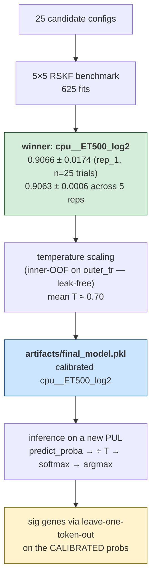

<div align="center">

# subFinder

**Predict the polysaccharide substrate of a bacterial PUL from its gene-token sequence.**

<sub>A leak-free 5×5 RSKF benchmark of 29 model configurations. One calibrated classical-ML pipeline that beats every published deep baseline by ≥8 pp on the same data.</sub>

<br>

[](paper/main.pdf)
[](paper/supplement.pdf)
[](docs/deck.pptx)
[](docs/deck.html)

</div>

---

## Headline

| Metric | Value | Source |
|---|---:|---|
| Test accuracy (5×5 RSKF, n=625 fits) | **0.9066 ± 0.0174** | [`artifacts/leaderboard.csv`](artifacts/leaderboard.csv) |
| Top-3 cumulative accuracy | **0.976** | [`docs/tables/tab_rank_redemption.csv`](docs/tables/tab_rank_redemption.csv) |
| High-confidence (≥0.8) accuracy | **97.4 %** on 67 % of PULs | [`docs/tables/tab_confidence_vs_correct.csv`](docs/tables/tab_confidence_vs_correct.csv) |
| Gap vs paper BRF baseline | **+6.64 pp** (paired *t*, p ≈ 5×10⁻¹⁴) | [`paper/audit_output.txt`](paper/audit_output.txt) |
| Gap vs best deep model | **+11.77 pp** | [`paper/audit_output.txt`](paper/audit_output.txt) |
| ECE (10-bin) after T-scaling | 0.094 → **0.029** | [`artifacts/calibration_report.csv`](artifacts/calibration_report.csv) |
| Per-PUL sig-gene hit rate (TRUE-class, K=3) | **768/837 = 91.8 %** | [`paper/tables/`](paper/tables/) |

> **On model-init variance.** Earlier releases shipped a 5-rep suite that re-trained
> everything under `REPRO_REP_SEED=1000/2000/3000/4000/5000` to quantify how much the
> winner moves when only the trainer seed changes. That suite was retired in Aug 2026
> along with the per-fold embeddings it was built on, so **this release does not
> measure model-init variance** and makes no claim about it. What it does establish is
> exact reproducibility at a fixed seed: with `REPRO_REP_SEED=1000`, all 25 folds of
> `cpu__ET500_log2` reproduce bit-identically. Re-running the suite is a matter of
> looping the seed — nothing in the pipeline prevents it.

**Want the visuals?** Open [`docs/deck.html`](docs/deck.html) (25 interactive slides) or [`docs/deck.pptx`](docs/deck.pptx).
**Want to browse every individual test PUL?** Open [`docs/per_pul_report.html`](docs/per_pul_report.html) — 13 tabs (overview + one per substrate), every test PUL with full calibrated probabilities, p-values, signature genes, literature-match badges, and per-fold OOV.

**Want to see what the deployed model says about *unlabeled* PULs?** Browse the [`unravel/`](unravel/) folder — 358,751 unique PULs from the unsupervised pre-training corpus run through the deployed model, with **350,349 evaluable** (token-count + ≥1-CAZy filter; OOV is no longer a hard filter, it's a slider).

Entry point: [`unravel/index.html`](unravel/index.html) (Overview tab) → per-substrate page links → live filters / sort / histograms / trust-calibrator score on every PUL.

Each substrate page (e.g. `unravel/alpha-glucan.html`) shows:
- **Live filter bar** — tier checkboxes, confidence ≥ X, out-of-vocab ≤ Y, Jaccard agreement, trust ≥ Z, hide-extrapolation, asc/desc sort dropdown
- **Live histograms** of confidence / out-of-vocab / token count that redraw as you filter
- **Trust calibrator panel** — a logistic regression learned on 8,240 multi-CV samples (5×5 RSKF + k=3 × 3 seeds) that predicts P(correct | features). Reports per-feature p-values, odds ratios, and recommended cutoffs. Each PUL row has a trust score + an extrapolation badge if any feature is outside the supervised [P1, P99] range.
- **Per-PUL rows** with sequence preview (first 12 tokens, click for full), 12 calibrated probability bars, top-5 signature genes with literature-match badges, and the 3 most similar labeled PULs (Jaccard top-3 retrieval).

**Reviewer regeneration** (the heavy HTMLs are ~50–140 MB each so `beta-glucan.html`, `host-glycan.html`, and the all-in-one `unravel_report.html` are `.gitignore`'d — rebuild locally):

```bash
bash unravel/run_unravel.sh                                # ~4 min (350K PULs, all-cores n_jobs=-1)
python3 unravel/filtering/build_trust_calibrator.py        # ~2 min (multi-CV trust regression)
python3 unravel/filtering/apply_trust_to_unravel.py        # ~30 s (scores each PUL + injects UI)
bash unravel/unravel_status.sh                              # live progress monitor
```

All committed scripts/JSONs live in [`unravel/filtering/`](unravel/filtering/) for full reproducibility.

---

## How the pipeline works (1 minute)

There is **one** model: `cpu__ET500_log2`. Picked out of 25 candidates, calibrated, and deployed — all using the same 5×5 RSKF splits, so the calibrated probabilities, the deployed model, and the per-PUL signature genes describe the *same single fitted classifier* at different stages.



---

## Pick your path

| You are… | Go to | Time |
|---|---|---:|
| 🧪 **Practitioner** — I have a PUL, predict its substrate | **[Path A](#path-a--predict-the-substrate-of-your-pul)** | 5 min |
| 🔍 **Reviewer** — verify every paper number, no training | **[Path B](#path-b--reproduce-every-paper-number)** | 10 min |
| 🔬 **Researcher** — ablations, retrain, extend | **[Path C](#path-c--retrain-or-extend)** | 30 min – 12 h |

> 🚨 **All paths need Git LFS.** Without it, a `git clone` gives you 135-byte pointer files instead of the actual model + n-gram blobs. Run `brew install git-lfs && git lfs install` **once per machine**, then clone normally.

---

## Path A — Predict the substrate of *your* PUL

```bash
# 1. One-time LFS install (skip if already done)
brew install git-lfs && git lfs install

# 2. Clone — LFS auto-fetches the 173 MB deployed model
git clone https://github.com/vedpiyush93-stack/subFinder_May_Release.git
cd subFinder_May_Release && pip install -r requirements.txt

# 3. Predict
python3 scripts/06_inference.py --seq "GH13,CBM6|PfkB,GH97_4|null" --pretty
```

### Three input formats

| Flag | Use when… | Example |
|---|---|---|
| `--seq "..."` | You already have the PUL token-string | `--seq "GH13,CBM6\|null"` |
| `--in-csv FILE --col sig_gene_seq` | You have many PULs in a CSV | `--in-csv my_puls.csv --out preds.csv` |
| `--cgc-standard FILE` | You ran dbCAN — feed `cgc_standard.out` directly | `--cgc-standard data/example_cgc_standard.out` |

Try the shipped example: `bash scripts/verify_cgc_format.sh` (parses [`data/example_cgc_standard.out`](data/example_cgc_standard.out), should predict `chitin`).

### Reading the output

| Field | Meaning |
|---|---|
| `predicted substrate` | argmax over 12 classes |
| `calibrated probs` | full probability vector after T-scaling (ECE ≈ 0.03) |
| `top-5 sig genes` | tokens whose removal drops the predicted-class probability the most |
| `OOV proportion` | fraction of PUL tokens not in the training vocab |
| `refuse_to_predict` | informational flag (`True` if OOV > 10 %); see [OOV reference](#reference--out-of-vocabulary-tokens) |

> **Tokenizer tip:** `tok_cpu` splits on `,`, `|`, **and** `_`. So `GH43_34` becomes `[GH43, 34]` — the subfamily index is its own token. For TC numbers (e.g. `1.B.14.12.1` vs `1.B.14`), pass `--tc-mode both|truncate|full` to control which form is emitted.

---

## Path B — Reproduce every paper number

No training, no GPU, no downloads beyond the LFS-aware clone. Every leaderboard / calibration / sig-gene number recomputes from the **2,675 lightweight prediction files** already in `artifacts/predictions/`.

```bash
# Clone + install (same as Path A, steps 1-2)

# Regenerate everything in order
python3 scripts/04_benchmark.py            # ~5 s   leaderboard.csv (29 rows)
python3 scripts/05_calibrate_best.py       # ~30 s  calibration_report.csv (4 methods)
python3 scripts/07_build_paper_artifacts.py # ~45 s  paper/tables/*.csv + audit_output.txt
python3 scripts/10_build_case_studies.py   # ~5 s   docs/figures/fig11-13.png + tables
python3 scripts/11_build_cross_rep_stability.py # ~3 s  docs/figures/fig14.png + cross-rep CSVs
python3 scripts/12_build_per_pul_report.py # ~10 s  docs/per_pul_report.html (1030 test PULs, 13 tabs)
python3 scripts/08_build_static_deck.py    # ~30 s  docs/deck.pptx
python3 scripts/09_build_interactive_deck.py # ~10 s  docs/deck.html

# Optional: run the master notebook for embedded outputs
jupyter nbconvert --to notebook --execute --inplace notebooks/build_paper_artifacts.ipynb
```

Every `\textbf{...}` in the PDFs maps to one key in [`paper/audit_output.txt`](paper/audit_output.txt). Sample:

```
top1_acc                                        0.9066
gap_ours_vs_paper_baseline                      0.0664
gap_ours_vs_best_paper_dl                       0.1183
mean_T                                          0.6996
per_sub_sig_GT_pul_hit_rate                     91.8%
per_sub_sig_GT_scope_recall                     63.0%
```

To verify the deployed model itself: `python3 scripts/06_inference.py --seq "GH13,CBM6|null" --pretty` — should predict `alpha-glucan` with confidence ≈ 0.83.

---

## Path C — Retrain or extend

Everything you need is in the clone — all six embeddings, the unsupervised training
corpus, both deployed models, and every per-trial prediction. **This repository uses
no Git LFS at all**, so `git clone` is the whole story.

### What is not shipped: per-trial classifier weights

The 625 trained classifiers (one per config × fold) came to 6.4 GB and are no longer
included. Nothing downstream needs them: the leaderboard, per-fold metrics, paper
tables, figures, decks and per-PUL report all read the probability matrices
(`probs_test.npz` / `probs_train.npz`) and `meta.json`, which **are** tracked. Only
[`scripts/12_build_per_pul_report.py`](scripts/12_build_per_pul_report.py) loads a
weight file, and only the winner's.

Regenerate them exactly:

```bash
export REPRO_REP_SEED=1000                     # required — see the note in C.2

python3 scripts/02_train_shallow.py --retrain --only cpu__ET500_log2   # ~2 min, winner only
python3 scripts/02_train_shallow.py --retrain                          # ~20 min, all 9 shallow
python3 scripts/03_train_deep.py    --retrain                          # ~1.5 h, all 16 deep
```

**How exactly do these reproduce?**

| | reproducibility |
|---|---|
| The 9 shallow configs (sklearn) | **Bit-identical**, anywhere. Verified: all 25 folds of `cpu__ET500_log2` reproduce the shipped `meta.json` values exactly. |
| The 16 deep configs (Keras/TF) | **Bit-identical on the same machine and backend** — verified by re-running completed fits and matching to six decimals. Across *different* hardware or backends (Metal GPU vs CPU vs CUDA, different TF builds) expect small drift, since floating-point reduction order differs. Accuracies should land within ~1e-3; individual PUL predictions may flip near the decision boundary. |

The shipped `probs_*.npz` are the authoritative record of what this release produced,
so any paper number can be checked without retraining anything.

### C.1 — Leakage audit (5 s)

```bash
pytest tests/leak_audit.py -v
# asserts outer_test ∩ outer_train = ∅ for every (seed, fold) split
# asserts the embeddings are global and label-free: one model per architecture,
#   trained only on the unsupervised corpus, with no per-fold variants
# asserts a PUL featurizes identically regardless of which fold it lands in
```

Until May 2026 embeddings were trained per fold, and this audit asserted that a
fold's embedding never saw its own test rows. That assertion passed but did not
mean what it looked like: each fold's corpus was the unsupervised corpus **plus**
~824 supervised training rows, and all 1,030 supervised PULs already occur
verbatim inside the unsupervised corpus (1030/1030 exact sequence matches). The
current guarantee is stronger — the embeddings never see a supervised row or a
label at all.

### C.2 — Retrain the winning model (10 min, no embeddings)

`cpu__ET500_log2` uses only CountVectorizer features — no embeddings needed.

```bash
export REPRO_REP_SEED=1000      # REQUIRED to reproduce the shipped numbers
python3 scripts/02_train_shallow.py --only cpu__ET500_log2 --retrain
python3 scripts/05_calibrate_best.py
python3 scripts/04_benchmark.py
```

> **`REPRO_REP_SEED=1000` is not optional.** `artifacts/` *is* rep_1: every shipped
> classifier there was fitted with `random_state=1000`, which is what the headline
> 0.9066 refers to. The environment variable defaults to **42**, so running these
> commands without exporting it silently trains a different model — reproducing
> 0.9058 instead of 0.9066, differing on 1–3 PULs in 13 of the 25 folds. Nothing
> warns you; the split, the vocabulary (488 tokens) and the feature matrix are all
> bit-identical, only the ExtraTrees model init differs. Verified: with the seed
> exported, fold r42_f0 reproduces 0.898058 exactly.

### C.3 — Retrain any embedding-using config

The six shipped embeddings cover everything downstream. Rebuilding them from the
corpus takes ~21 minutes, not the ~8 hours the per-fold scheme needed.

```bash
python3 scripts/02_train_shallow.py --retrain          # ~20 min, all 9 shallow configs
python3 scripts/03_train_deep.py    --retrain          # ~2.5 h on M4 Max, 16 deep configs
python3 scripts/01_train_embeddings.py --retrain       # ~21 min, rebuilds all six embeddings
```

**Compute device.** The deep configs use the Apple Metal (MPS) GPU backend when
`tensorflow-metal` is installed — `03_train_deep.py` prints the active device at
startup and records it in every trial's `meta.json`, and takes
`--device {auto,gpu,cpu}`. Measured per epoch on an M4 Max: `Trans` 451 ms on
Metal vs 2447 ms on CPU (5.4×); `JustAttn` 1.3×; the LSTM family is bound by
per-epoch overhead (824 rows / batch 1024 = one batch per epoch) rather than
arithmetic, so it sees no GPU benefit. Published DL numbers were trained on Metal.

### C.4 — Use the embeddings from Python

```python
from src.embeddings.loader import load_word_vectors, load_doc2vec

wv = load_word_vectors("fasttext_cbow")     # 14 MB, loads instantly
v_known = wv["GT2"]                          # in-vocab → trained vector
v_oov   = wv["GH13_99_NEW"]                  # OOV → resolved from character fragments (NOT zero)

d2v = load_doc2vec("doc2vec_dbow")           # document vectors, not word vectors
vec = d2v.infer_vector(["GH13", "CBM48", "2.A.1"])
```

**How FastText storage works here.** gensim keeps character-fragment vectors in a
hash table of `bucket` rows addressed by `hash(fragment) % bucket`. At the paper's
`bucket=2,000,000` that table is 2.24 GB per model — but the corpus vocabulary
(1,458 tokens) only generates 11,114 distinct fragments, so **99.45 % of those
rows cannot be reached by any possible input**. We therefore store one row per
fragment that actually exists, keyed by the fragment's text, which is both
collision-free and 180× smaller. Training is unchanged and still runs at the
paper's bucket size; only storage and lookup differ.

Equivalence is reviewer-runnable: `pytest -q -s tests/verify_reduced_embedding_files.py`
trains a real FastText, compacts it, and checks in-vocabulary vectors (exactly 0
difference) and both featurizers over all 1,030 PULs (<1e-5, from float32
summation order). The one documented divergence is a token whose fragments appear
nowhere in the corpus: gensim reads those from rows training never touched
(random initialisation), we contribute zero.

**Doc2Vec uses document vectors.** `infer_vector` runs gradient descent on the new
document's vector alone (`learn_words=False, learn_hidden=False`), so the trained
model is never updated by a sample it featurizes. It is stochastic by default —
`Doc2VecInferFeaturizer` reseeds the model's RNG before each call, which makes
inference bitwise reproducible.

---

## Repository layout

```
subFinder_May_Release/
├── data/                    1,030 labeled PULs + curated CAZy↔substrate DB + unsupervised corpus (359,763 PULs, 5.7 MB gz)
├── src/                     library (preprocessing, embeddings, shallow, deep, calibration, ablation, inference)
├── scripts/                 12 CLI drivers (01_train_embeddings → 12_build_per_pul_report)
├── notebooks/               build_paper_artifacts.ipynb (master end-to-end feeder)
├── artifacts/
│   ├── predictions/         25 configs × 25 trials × {probs_test.npz, probs_train.npz, classifier.*, meta.json}
│   ├── calibration/         per-fold T + 4-method comparison
│   ├── ablation/            leave-one-token-out Δ-prob (argmax + TRUE, raw + calibrated)
│   ├── embeddings/          6 global embeddings, ~38 MB total, regular git (no LFS)
│   ├── leaderboard.csv      25-row sorted leaderboard
│   ├── per_fold_metrics.csv 625-row per-trial CSV
│   └── final_model.pkl      deployed calibrated model (LFS)
├── paper/                   PDFs + 12 source tables + audit_output.txt
├── docs/                    deck.pptx + deck.html + figures/ + tables/
└── tests/                   leak_audit.py + verify_reduced_embedding_files.py
```

---

## Reference

<details>
<summary><b>The model in one block</b></summary>

```
features  : CountVectorizer(tokenizer=tok_cpu, lowercase=False)
            tok_cpu splits on ',', '|', '_'  (3 separators)
            ~488 tokens per fold (fit per fold on outer-train only — leak-free)

classifier: OneVsRestClassifier(ExtraTreesClassifier(
              n_estimators=500, max_features='log2',
              class_weight='balanced', bootstrap=False))

calibration: temperature scaling — one scalar T per outer fold,
             fit on inner-5-fold OOF NLL of outer_train.
             Mean T ≈ 0.70 across folds.
```

The win is almost entirely from the classifier swap (BRF → OvR ExtraTrees). Two `BalancedRandomForestClassifier` design choices hurt on a small 12-class dataset: bootstrap-balanced sampling discards majority-class signal per tree, and the 100-tree ensemble is too small to recover the variance. OvR ExtraTrees-500 with `class_weight='balanced'` fixes both.

Full per-substrate / per-fold metrics: [`paper/tables/`](paper/tables/) and Supplement Tables S2–S10.

</details>

<details>
<summary><b>Calibration — why temperature scaling</b></summary>

| Method | OOF Accuracy | ECE (10-bin) | Argmax preserved? |
|---|---|---|---|
| Uncalibrated (raw OvR-ExtraTrees) | 0.9029 | 0.094 | — |
| **Temperature scaling (T ≈ 0.70)** | **0.9029** | **0.029** | **yes** (monotonic per-class) |
| Isotonic CV5 | 0.8903 | 0.040 | no — can re-rank classes |
| Sigmoid CV5 | 0.9019 | 0.153 | no |

Temperature scaling halves the ECE with one scalar; `logit / T / sigmoid` is monotonic, so argmax accuracy is mathematically unchanged. Implementation + leak-free guarantee in [`scripts/05_calibrate_best.py`](scripts/05_calibrate_best.py).

</details>

<details>
<summary><b>Signature genes — what we claim, how we validate</b></summary>

For every PUL we compute per-token Δ-prob under leave-one-token-out ablation on the **calibrated** probability:

```
Δ_s(t)  =  P_cal(s | tokens)  −  P_cal(s | tokens \ {t})
```

Two attribution flavors:

| Flavor | Target class `s` | What it measures |
|---|---|---|
| **argmax-class** (deployment) | the prediction | "What did the model think mattered for its call?" |
| **TRUE-class** (clean test) | ground-truth substrate | "Did the model attribute correctly when given the right answer?" |

**Headline (TRUE-class, K=3):** per-PUL any-hit = **768/837 = 91.8 %**, gene-scope coverage = **109/173 = 63.0 %**. Source: [`paper/tables/table12_per_substrate_sig_pr.csv`](paper/tables/table12_per_substrate_sig_pr.csv).

The 75 fine-grained DB substrate names roll up to our 12 classes via [`src/lit_validation/alias_map.py`](src/lit_validation/alias_map.py) — every non-trivial group has a primary-literature citation in the supplement.

</details>

<a id="reference--out-of-vocabulary-tokens"></a>
<details>
<summary><b>Out-of-vocabulary (OOV) tokens</b></summary>

The model's vocabulary is finite — built per fold by `CountVectorizer(tokenizer=tok_cpu).fit(outer_train)`. Typical fold-vocab size ≈ 488 tokens. New PULs may include tokens not in this vocab; those are OOV.

**Inference is identical regardless of OOV** — every PUL gets the same fields (substrate, calibrated probs, p-values, sig genes). Two extra fields report the OOV state:

| Field | Meaning |
|---|---|
| `oov_proportion` | `(# OOV tokens) / (# total tokens)` |
| `refuse_to_predict` | `True` iff `oov_proportion > 0.10` — a **caveat flag**, not a gate. Same outputs, just review before trusting. |

| OOV bucket | n PULs | accuracy |
|---|---:|---:|
| 0 % | 920 | **0.914** |
| 0–10 % | 53 | **1.000** |
| 10–25 % | 39 | **0.641** |
| ≥25 % | 18 | **0.611** |

Past 10 % OOV, accuracy collapses to ~0.62 — hence the flag. Full chart: [`docs/figures/fig8c_oov_vs_accuracy.png`](docs/figures/fig8c_oov_vs_accuracy.png).

</details>

<details>
<summary><b>Reproducibility — T scalar drift across reruns</b></summary>

Re-running `scripts/05_calibrate_best.py` yourself may give a `T` that differs in the 3rd–4th decimal from the shipped pickle. This is **environment drift** (BLAS / sklearn / scipy), not random noise — proven by running the script 3× back-to-back on the same machine and getting `std = 0.0000`. Predictions and headline accuracy are unaffected; only the 3rd-decimal of calibrated probs moves.

Reproduce the drift experiment: `python3 scripts/experiments/measure_t_drift.py --n-runs 5`. Output schema in [`artifacts/t_drift_runs.csv`](artifacts/t_drift_runs.csv).

</details>

<details>
<summary><b>Repository size / no Git LFS</b></summary>

This repository **does not use Git LFS**. Earlier releases tracked ~186 GB of FastText
n-gram tables plus ~6.4 GB of per-trial classifier weights through LFS; both are gone.
Every file now fits comfortably in regular git:

| What | Size |
|---|---:|
| `artifacts/embeddings/` — six global embeddings | 38 MB |
| `artifacts/final_model.pkl` (v1, xz-compressed) | 24 MB |
| `artifacts/final_model_v2.pkl` (v2, xz-compressed) | 21 MB |
| `data/unsupervised_corpus.txt.gz` — 359,763 PULs | 5.7 MB |
| `artifacts/predictions/` — 625 × probability matrices + meta | ~90 MB |

The bulk of what remains is the pre-rendered `unravel/` HTML views.

</details>

---

## Post-hoc refinement — `v2` tokenizer for cross-domain generalization

After applying the deployed model to the 359,763-PUL unsupervised pre-training corpus (see [`unravel/`](unravel/)), many unsupervised PULs were flagged **out-of-vocabulary (OOV)** despite sharing biology with supervised PULs. Root cause: **format mismatches** between the corpora.

- **TC numbers** — supervised data mixes 5-level (`1.B.14.6.1`) and 3-level (`1.B.14`) formats; the unsupervised corpus is **99.9 % 3-level** (1,677,571 of 1,678,991 TC tokens). A 5-level supervised token therefore never matches an unsupervised one, though both describe the same transporter.
- **CAZy subfamilies** — supervised never saw `AA17`, `CBM50`, etc., so novel families in unsupervised PULs go OOV with no fallback.

`tok_cpu_v2` fixes both:

1. **Truncate TC numbers to the 3-level family** (`1.B.14.6.1` → `1.B.14`).
2. **Augment CAZy tokens with a family-only fallback** (`GH13` → keep `GH13` **and** add `GH`).

| | original `tok_cpu` | refined `tok_cpu_v2` |
|---|---:|---:|
| 5×5 RSKF accuracy | 0.9066 ± 0.0174 | **0.9150 ± 0.0167** |
| Deployed vocab size | 517 | **360** |
| Unsupervised mean OOV | 21.3 % | **16.5 %** |
| Unsup PULs at OOV ≤ 10 % | 29.6 % | **37.4 %** |

### Why 3 levels and not 2

Until Aug 2026 this truncated to the **2-level** subclass (`1.B.14.6.1` → `1.B`). That was wrong, and the correction matters more than the accuracy table suggests.

TCDB numbers are `class.subclass.family.subfamily.protein`. **Level 3 is the family** — `1.B.14` is the Outer Membrane Receptor family, i.e. the TonB-dependent SusC-like receptors that define a PUL. Level 2 is merely "β-barrel porin". Truncating to 2 collapsed **596 distinct families into 26 tokens**: `2.A` alone swallowed 106 families, `9.B` 133, `1.B` 73.

That variant reported a far better unsupervised OOV (5.4 % vs 16.5 %), which looked like superior generalization but was an artifact — OOV is near-zero when the vocabulary has been reduced to almost nothing. On the measure that matters it was **not better**: 0.9151 ± 0.0189 at 2-level versus 0.9150 ± 0.0167 at 3-level, statistically indistinguishable, with 3-level slightly more stable across folds. Given equal accuracy, the version that preserves 596 biological families wins.

Three levels also matches the unsupervised corpus's native format exactly, which is what closes the format gap in the first place.

A TC-family fallback mirroring the CAZy trick (emitting `1.B` alongside `1.B.14`) was tested and **rejected**: 0.9148 ± 0.0132, marginally worse. The coarse token only dilutes the signal. The 2-level form is retained as `tok_cpu_tc2` for provenance.

**Additive — original deployed model unchanged:** the refinement ships as a SEPARATE artifact [`artifacts/final_model_v2.pkl`](artifacts/final_model_v2.pkl); the original [`artifacts/final_model.pkl`](artifacts/final_model.pkl) is preserved and remains the default. Both versions are bundled in-repo and ready to use:

```bash
# original (default)
python3 scripts/06_inference.py --seq "GH13,CBM6|null" --pretty

# refined (better for novel PULs)
python3 scripts/06_inference.py --model artifacts/final_model_v2.pkl --seq "GH13,CBM6|null" --pretty
```

**Self-contained distribution.** [`artifacts/final_model_v2.pkl`](artifacts/final_model_v2.pkl) is saved with `joblib.dump(..., compress=("xz", 6))`, shrinking it from 144 MB to **~20 MB** — tracked via regular git, **no LFS**. Loading is transparent: `joblib.load()` auto-detects the xz wrapper, so no inference code changes. Rebuild in ~90 s with `python3 scripts/13_train_tc2_refinement.py`.

**V2 signature-gene PR (lit-canon validation).** [`scripts/13c_v2_sig_gene_pr.py`](scripts/13c_v2_sig_gene_pr.py) runs the same leave-one-token-out ablation as the v1 paper analysis but with `tok_cpu_v2`, then scores top-3 sig-genes against a **family-augmented** literature canon (for every specific canon token like `GH13` it also adds the family prefix `GH` as a canonical family fallback). Result on the 5-fold seed-42 OOF: **804/1,028 PULs (78.2%) hit a lit-canonical signal in top-3** — 739 via specific token, **65 extra rescued by the family fallback**. Gene-view scope recall: specific tokens 96/173 = 55.5%, **family fallbacks 24/31 = 77.4%** (higher because there are fewer competitors at the family level — confirms the augmented family tokens carry consistent substrate-specific signal). Outputs: [`paper/tables/table12_v2_per_substrate_sig_pr.csv`](paper/tables/table12_v2_per_substrate_sig_pr.csv) (12 substrates × 14 cols, supplement Table S5b), [`paper/tables/table12_v2_aggregate_sig_pr.csv`](paper/tables/table12_v2_aggregate_sig_pr.csv) (aggregate), [`artifacts/ablation/sig_gene_ablation_oof_outer42_v2.csv`](artifacts/ablation/) (per-PUL top-K).

**V2 trust calibrator.** The unravel trust score (the per-PUL probability that a prediction is correct, given conf / OOV / lit-canon support / Jaccard-to-labeled-neighbor) was retrained for v2 — the original calibrator's coefficients were fit against v1's OOV and vocab distributions, so applying it directly to v2 would give biased scores (v2's OOV and vocabulary distributions differ). Build with `python3 unravel/filtering/build_trust_calibrator.py --v2`; apply to v2 HTMLs with `python3 unravel/filtering/apply_trust_v2.py --v2`. The v1 calibrator is preserved at the original paths; the v2 calibrator ships as `unravel/filtering/trust_calibrator_v2.pkl`, `trust_significance_v2.json`, `trust_extrapolation_ranges_v2.json`, `trust_training_set_v2.csv`. Same 13-candidate feature set, same significance+intuition filter — only the model weights and per-feature [P1, P99] extrapolation bands change.

**Strategy sweep documentation:** [`unravel/experiments/`](unravel/experiments/) contains the full 13-strategy comparison, dimensionality analysis, and `report.md` with the rationale. Curator-shareable artifacts: [`unravel/experiments/curator_brief.md`](unravel/experiments/curator_brief.md) (crisp 4-section brief, with same-family TC-depth examples and OOV impact tables) and [`unravel/experiments/curator_format_report.md`](unravel/experiments/curator_format_report.md) (full narrative).

> **⚠ `unravel/v2/` is stale as of the 3-level TC change.** Those HTMLs were
> generated with the previous 2-level `tok_cpu_v2`, so their predictions, OOV
> figures, trust scores and signature-gene chips still reflect that tokenizer.
> The v1 views in [`unravel/`](unravel/) are unaffected (they use `tok_cpu` and
> [`artifacts/final_model.pkl`](artifacts/final_model.pkl), neither of which
> changed). Regenerate with `python3 unravel/build_unravel_report.py --v2`
> followed by the trust-calibrator steps below.

**Parallel v2 unravel view:** [`unravel/v2/index.html`](unravel/v2/) re-applies the deployed model to the same 358,751-PUL unsupervised corpus using the v2 tokenizer, producing per-substrate HTMLs alongside the originals at [`unravel/*.html`](unravel/). Sig-gene chips in the v2 view visually separate **signature tokens** (specific, e.g. `GH13`) from **signature families** (the augmented fallback, e.g. `GH`, rendered with a dashed border + `FAM` label) so reviewers can see exactly which signal came from which. Build both views with `python3 unravel/build_unravel_report.py` (v1, default) and `python3 unravel/build_unravel_report.py --v2` (v2).

**Heavy unravel HTMLs (ship-as-zip).** Six per-substrate HTMLs exceed GitHub's 100 MB per-file hard limit (`unravel/{beta-glucan,host-glycan,unravel_report}.html` and the same three under `unravel/v2/`). They ship in-repo as `.zip` companions next to the original paths — total ~141 MB across all 6, vs ~1.5 GB raw — and a one-line helper restores them in place after clone:

```bash
bash unravel/unzip_heavy.sh
```

The helper is idempotent (skips files whose unzipped HTML is already newer than its `.zip`). After running it, open [`unravel/index.html`](unravel/index.html) or [`unravel/v2/index.html`](unravel/v2/) in a browser — every per-substrate tab renders without retraining or re-running inference.

---

## Decks

25 slides each — same content in two formats:

- **[`docs/deck.pptx`](docs/deck.pptx)** — download to open in PowerPoint/Keynote
- **[`docs/deck.html`](docs/deck.html)** — interactive Plotly (hover, zoom, keyboard arrows). Clone the repo and `open docs/deck.html` to view; GitHub's web viewer renders it as raw HTML.

Includes 4 reviewer-impact slides: **cross-rep stability forest plot** (5 reps × 25 trials, fixed splits), rank-K redemption, calibrated confidence vs correctness, 6 hand-picked PUL case studies.

**Per-PUL test-set report:** [`docs/per_pul_report.html`](docs/per_pul_report.html) — 13 tabs (Overview + one per substrate class), every test PUL from rep_1's seed-42 OOF with calibrated probabilities for all 12 classes, p-values, top-5 signature genes with literature-match badges (exact / collapse / non-canonical), and per-PUL OOV vs that PUL's training fold vocab. Single self-contained file, ~4 MB. Regenerate with `python3 scripts/12_build_per_pul_report.py`.

---

## Citation

```bibtex
@misc{subfinder2026,
  title  = {subFinder: Calibrated classical-ML for polysaccharide utilization locus substrate prediction},
  author = {<authors>},
  year   = {2026},
  url    = {https://github.com/vedpiyush93-stack/subFinder_May_Release}
}
```

---

<div align="center">
<sub>Built with attention to detail. Issues and PRs welcome.</sub>
</div>
