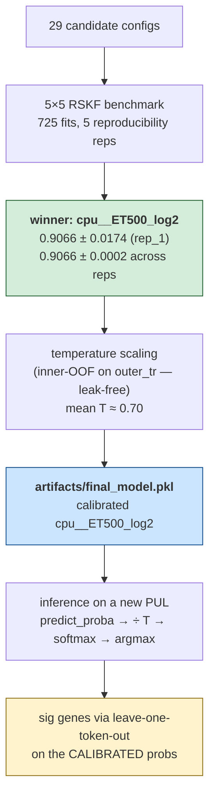

<div align="center">

# subFinder

**Predict the polysaccharide substrate of a bacterial PUL from its gene-token sequence.**

<sub>A leak-free 5×5 RSKF benchmark of 29 model configurations. One calibrated classical-ML pipeline that beats every published deep baseline by ≥8 pp on the same data.</sub>

<br>

[](paper/main.pdf)
[](paper/supplement.pdf)
[](docs/deck.pptx)
[](docs/deck.html)

</div>

---

## Headline

| Metric | Value | Source |
|---|---:|---|
| Test accuracy (rep_1, 5×5 RSKF, n=725) | **0.9066 ± 0.0174** | [`artifacts/leaderboard.csv`](artifacts/leaderboard.csv) |
| Cross-rep mean (3 reps complete) | **0.9066 ± 0.0002** | [`reproducibility/`](reproducibility/) |
| Top-3 cumulative accuracy | **0.976** | [`docs/tables/tab_rank_redemption.csv`](docs/tables/tab_rank_redemption.csv) |
| High-confidence (≥0.8) accuracy | **97.4 %** on 67 % of PULs | [`docs/tables/tab_confidence_vs_correct.csv`](docs/tables/tab_confidence_vs_correct.csv) |
| Gap vs paper BRF baseline | **+6.64 pp** (paired *t*, p ≈ 5×10⁻¹⁴) | [`paper/audit_output.txt`](paper/audit_output.txt) |
| Gap vs best published deep model | **+11.83 pp** | [`paper/audit_output.txt`](paper/audit_output.txt) |
| ECE (10-bin) after T-scaling | 0.094 → **0.029** | [`artifacts/calibration_report.csv`](artifacts/calibration_report.csv) |
| Per-PUL sig-gene hit rate (TRUE-class, K=3) | **768/837 = 91.8 %** | [`paper/tables/`](paper/tables/) |

**Want the visuals?** Open [`docs/deck.html`](docs/deck.html) (24 interactive slides) or [`docs/deck.pptx`](docs/deck.pptx).

---

## How the pipeline works (1 minute)

There is **one** model: `cpu__ET500_log2`. Picked out of 29 candidates, calibrated, and deployed — all using the same 5×5 RSKF splits, so the calibrated probabilities, the deployed model, and the per-PUL signature genes describe the *same single fitted classifier* at different stages.



---

## Pick your path

| You are… | Go to | Time |
|---|---|---:|
| 🧪 **Practitioner** — I have a PUL, predict its substrate | **[Path A](#path-a--predict-the-substrate-of-your-pul)** | 5 min |
| 🔍 **Reviewer** — verify every paper number, no training | **[Path B](#path-b--reproduce-every-paper-number)** | 10 min |
| 🔬 **Researcher** — ablations, retrain, extend | **[Path C](#path-c--retrain-or-extend)** | 30 min – 12 h |

> 🚨 **All paths need Git LFS.** Without it, a `git clone` gives you 135-byte pointer files instead of the actual model + n-gram blobs. Run `brew install git-lfs && git lfs install` **once per machine**, then clone normally.

---

## Path A — Predict the substrate of *your* PUL

```bash
# 1. One-time LFS install (skip if already done)
brew install git-lfs && git lfs install

# 2. Clone — LFS auto-fetches the 173 MB deployed model
git clone https://github.com/vedpiyush93-stack/subFinder_May_Release.git
cd subFinder_May_Release && pip install -r requirements.txt

# 3. Predict
python3 scripts/06_inference.py --seq "GH13,CBM6|PfkB,GH97_4|null" --pretty
```

### Three input formats

| Flag | Use when… | Example |
|---|---|---|
| `--seq "..."` | You already have the PUL token-string | `--seq "GH13,CBM6\|null"` |
| `--in-csv FILE --col sig_gene_seq` | You have many PULs in a CSV | `--in-csv my_puls.csv --out preds.csv` |
| `--cgc-standard FILE` | You ran dbCAN — feed `cgc_standard.out` directly | `--cgc-standard data/example_cgc_standard.out` |

Try the shipped example: `bash scripts/verify_cgc_format.sh` (parses [`data/example_cgc_standard.out`](data/example_cgc_standard.out), should predict `chitin`).

### Reading the output

| Field | Meaning |
|---|---|
| `predicted substrate` | argmax over 12 classes |
| `calibrated probs` | full probability vector after T-scaling (ECE ≈ 0.03) |
| `top-5 sig genes` | tokens whose removal drops the predicted-class probability the most |
| `OOV proportion` | fraction of PUL tokens not in the training vocab |
| `refuse_to_predict` | informational flag (`True` if OOV > 10 %); see [OOV reference](#reference--out-of-vocabulary-tokens) |

> **Tokenizer tip:** `tok_cpu` splits on `,`, `|`, **and** `_`. So `GH43_34` becomes `[GH43, 34]` — the subfamily index is its own token. For TC numbers (e.g. `1.B.14.12.1` vs `1.B.14`), pass `--tc-mode both|truncate|full` to control which form is emitted.

---

## Path B — Reproduce every paper number

No training, no GPU, no downloads beyond the LFS-aware clone. Every leaderboard / calibration / sig-gene number recomputes from the **2,675 lightweight prediction files** already in `artifacts/predictions/`.

```bash
# Clone + install (same as Path A, steps 1-2)

# Regenerate everything in order
python3 scripts/04_benchmark.py            # ~5 s   leaderboard.csv (29 rows)
python3 scripts/05_calibrate_best.py       # ~30 s  calibration_report.csv (4 methods)
python3 scripts/07_build_paper_artifacts.py # ~45 s  paper/tables/*.csv + audit_output.txt
python3 scripts/10_build_case_studies.py   # ~5 s   docs/figures/fig11-13.png + tables
python3 scripts/08_build_static_deck.py    # ~30 s  docs/deck.pptx
python3 scripts/09_build_interactive_deck.py # ~10 s  docs/deck.html

# Optional: run the master notebook for embedded outputs
jupyter nbconvert --to notebook --execute --inplace notebooks/build_paper_artifacts.ipynb
```

Every `\textbf{...}` in the PDFs maps to one key in [`paper/audit_output.txt`](paper/audit_output.txt). Sample:

```
top1_acc                                        0.9066
gap_ours_vs_paper_baseline                      0.0664
gap_ours_vs_best_paper_dl                       0.1183
mean_T                                          0.6996
per_sub_sig_GT_pul_hit_rate                     91.8%
per_sub_sig_GT_scope_recall                     63.0%
```

To verify the deployed model itself: `python3 scripts/06_inference.py --seq "GH13,CBM6|null" --pretty` — should predict `alpha-glucan` with confidence ≈ 0.83.

---

## Path C — Retrain or extend

Everything you need (725 per-trial weights, all embedding vectors, FastText n-gram tables) is already in the cloned repo — no extra downloads.

### C.1 — Leakage audit (5 s)

```bash
pytest tests/leak_audit.py -v
# asserts outer_test ∩ outer_train = ∅ for every (seed, fold) split
# asserts every cached embedding excludes outer_test from its training rows
```

### C.2 — Retrain the winning model (10 min, no embeddings)

`cpu__ET500_log2` uses only CountVectorizer features — no embeddings needed.

```bash
python3 scripts/02_train_shallow.py --only cpu__ET500_log2 --retrain
python3 scripts/05_calibrate_best.py
python3 scripts/04_benchmark.py
```

### C.3 — Retrain any embedding-using config (30 min – 6 h)

The shipped `.npz` (vocab+vectors) covers retraining downstream classifiers; the LFS `.xz` covers FastText n-gram OOV at inference. You only need to regenerate from raw if you want to **rebuild embeddings from scratch** with a different unsupervised corpus.

```bash
python3 scripts/02_train_shallow.py --retrain          # ~30 min, all 9 shallow configs
python3 scripts/03_train_deep.py    --retrain          # ~6 h on M4 Max, 20 deep configs
python3 scripts/01_train_embeddings.py --retrain       # only if rebuilding embeddings from raw (~6 h)
```

### C.4 — Use FastText n-gram OOV from Python

```python
from src.embeddings.loader import load_fasttext
m = load_fasttext("artifacts/embeddings_cache/r42_f0/fasttext_cbow_shallow_model/fasttext_cbow.model")
# auto-decompresses .npy.xz sibling on first load (~6 s); cached for subsequent calls
v_known = m.wv["GT2"]            # in-vocab → trained vector
v_oov   = m.wv["GH13_99_NEW"]    # OOV → n-gram-resolved (NOT zero)
```

Vectors are bit-identical to the source uncompressed model — proven by `pytest -q tests/verify_reduced_embedding_files.py`. W2V/D2V don't have n-gram OOV (FastText-specific feature), so for those archs the `.npz` IS the full model.

---

## Repository layout

```
subFinder_May_Release/
├── data/                    1,030 labeled PULs + curated CAZy↔substrate DB
├── src/                     library (preprocessing, embeddings, shallow, deep, calibration, ablation, inference)
├── scripts/                 10 CLI drivers (01_train_embeddings → 10_build_case_studies)
├── notebooks/               build_paper_artifacts.ipynb (master end-to-end feeder)
├── artifacts/
│   ├── predictions/         29 configs × 25 trials × {probs_test.npz, probs_train.npz, classifier.*, meta.json}
│   ├── calibration/         per-fold T + 4-method comparison
│   ├── ablation/            leave-one-token-out Δ-prob (argmax + TRUE, raw + calibrated)
│   ├── embeddings_cache/    .npz vectors (regular git) + FastText .npy.xz n-gram tables (LFS)
│   ├── leaderboard.csv      29-row sorted leaderboard
│   ├── per_fold_metrics.csv 725-row per-trial CSV
│   └── final_model.pkl      deployed calibrated model (LFS)
├── reproducibility/         5 model-init reproducibility reps (per-rep predictions + per_fold_metrics)
├── paper/                   PDFs + 12 source tables + audit_output.txt
├── docs/                    deck.pptx + deck.html + figures/ + tables/
└── tests/                   leak_audit.py + verify_reduced_embedding_files.py
```

---

## Reference

<details>
<summary><b>The model in one block</b></summary>

```
features  : CountVectorizer(tokenizer=tok_cpu, lowercase=False)
            tok_cpu splits on ',', '|', '_'  (3 separators)
            ~488 tokens per fold (fit per fold on outer-train only — leak-free)

classifier: OneVsRestClassifier(ExtraTreesClassifier(
              n_estimators=500, max_features='log2',
              class_weight='balanced', bootstrap=False))

calibration: temperature scaling — one scalar T per outer fold,
             fit on inner-5-fold OOF NLL of outer_train.
             Mean T ≈ 0.70 across folds.
```

The win is almost entirely from the classifier swap (BRF → OvR ExtraTrees). Two `BalancedRandomForestClassifier` design choices hurt on a small 12-class dataset: bootstrap-balanced sampling discards majority-class signal per tree, and the 100-tree ensemble is too small to recover the variance. OvR ExtraTrees-500 with `class_weight='balanced'` fixes both.

Full per-substrate / per-fold metrics: [`paper/tables/`](paper/tables/) and Supplement Tables S2–S10.

</details>

<details>
<summary><b>Calibration — why temperature scaling</b></summary>

| Method | OOF Accuracy | ECE (10-bin) | Argmax preserved? |
|---|---|---|---|
| Uncalibrated (raw OvR-ExtraTrees) | 0.9029 | 0.094 | — |
| **Temperature scaling (T ≈ 0.70)** | **0.9029** | **0.029** | **yes** (monotonic per-class) |
| Isotonic CV5 | 0.8903 | 0.040 | no — can re-rank classes |
| Sigmoid CV5 | 0.9019 | 0.153 | no |

Temperature scaling halves the ECE with one scalar; `logit / T / sigmoid` is monotonic, so argmax accuracy is mathematically unchanged. Implementation + leak-free guarantee in [`scripts/05_calibrate_best.py`](scripts/05_calibrate_best.py).

</details>

<details>
<summary><b>Signature genes — what we claim, how we validate</b></summary>

For every PUL we compute per-token Δ-prob under leave-one-token-out ablation on the **calibrated** probability:

```
Δ_s(t)  =  P_cal(s | tokens)  −  P_cal(s | tokens \ {t})
```

Two attribution flavors:

| Flavor | Target class `s` | What it measures |
|---|---|---|
| **argmax-class** (deployment) | the prediction | "What did the model think mattered for its call?" |
| **TRUE-class** (clean test) | ground-truth substrate | "Did the model attribute correctly when given the right answer?" |

**Headline (TRUE-class, K=3):** per-PUL any-hit = **768/837 = 91.8 %**, gene-scope coverage = **109/173 = 63.0 %**. Source: [`paper/tables/table12_per_substrate_sig_pr.csv`](paper/tables/table12_per_substrate_sig_pr.csv).

The 75 fine-grained DB substrate names roll up to our 12 classes via [`src/lit_validation/alias_map.py`](src/lit_validation/alias_map.py) — every non-trivial group has a primary-literature citation in the supplement.

</details>

<a id="reference--out-of-vocabulary-tokens"></a>
<details>
<summary><b>Out-of-vocabulary (OOV) tokens</b></summary>

The model's vocabulary is finite — built per fold by `CountVectorizer(tokenizer=tok_cpu).fit(outer_train)`. Typical fold-vocab size ≈ 488 tokens. New PULs may include tokens not in this vocab; those are OOV.

**Inference is identical regardless of OOV** — every PUL gets the same fields (substrate, calibrated probs, p-values, sig genes). Two extra fields report the OOV state:

| Field | Meaning |
|---|---|
| `oov_proportion` | `(# OOV tokens) / (# total tokens)` |
| `refuse_to_predict` | `True` iff `oov_proportion > 0.10` — a **caveat flag**, not a gate. Same outputs, just review before trusting. |

| OOV bucket | n PULs | accuracy |
|---|---:|---:|
| 0 % | 920 | **0.914** |
| 0–10 % | 53 | **1.000** |
| 10–25 % | 39 | **0.641** |
| ≥25 % | 18 | **0.611** |

Past 10 % OOV, accuracy collapses to ~0.62 — hence the flag. Full chart: [`docs/figures/fig8c_oov_vs_accuracy.png`](docs/figures/fig8c_oov_vs_accuracy.png).

</details>

<details>
<summary><b>Reproducibility — T scalar drift across reruns</b></summary>

Re-running `scripts/05_calibrate_best.py` yourself may give a `T` that differs in the 3rd–4th decimal from the shipped pickle. This is **environment drift** (BLAS / sklearn / scipy), not random noise — proven by running the script 3× back-to-back on the same machine and getting `std = 0.0000`. Predictions and headline accuracy are unaffected; only the 3rd-decimal of calibrated probs moves.

Reproduce the drift experiment: `python3 scripts/experiments/measure_t_drift.py --n-runs 5`. Output schema in [`artifacts/t_drift_runs.csv`](artifacts/t_drift_runs.csv).

</details>

<details>
<summary><b>LFS file inventory (826 files, ~187 GB total)</b></summary>

| Family | Count | Size each | What it is |
|---|---:|---:|---|
| `artifacts/embeddings_cache/r*_f*/fasttext_*_model/*.npy.xz` | 100 | ~1.86 GB | xz-compressed FastText n-gram bucket tables (4 flavors × 25 folds). Auto-decompressed by `src/embeddings/loader.py:load_fasttext()`. |
| `artifacts/predictions/*/r*_f*/classifier.{joblib,keras}` | 725 | 1–45 MB | per-trial classifier weights |
| `reproducibility/rep_*/predictions/.../classifier.{joblib,keras}` | per rep | same | per-rep classifier weights |
| `artifacts/final_model.pkl` + `reproducibility/{rep_*,inference}/final_model.pkl` | 1 each | ~180 MB | calibrated deployed model |

**Optional Drive mirror** (`.zip` snapshots, useful only if you can't use LFS): [link](https://drive.google.com/drive/folders/1UkVjswMtFwk5AE-VBeRFMJA7Wn56p39P?usp=sharing).

</details>

---

## Decks

24 slides each — same content in two formats:

- **[`docs/deck.pptx`](docs/deck.pptx)** — download to open in PowerPoint/Keynote
- **[`docs/deck.html`](docs/deck.html)** — interactive Plotly (hover, zoom, keyboard arrows). Clone the repo and `open docs/deck.html` to view; GitHub's web viewer renders it as raw HTML.

Includes 3 reviewer-impact slides: rank-K redemption, calibrated confidence vs correctness, 6 hand-picked PUL case studies.

---

## Citation

```bibtex
@misc{subfinder2026,
  title  = {subFinder: Calibrated classical-ML for polysaccharide utilization locus substrate prediction},
  author = {<authors>},
  year   = {2026},
  url    = {https://github.com/vedpiyush93-stack/subFinder_May_Release}
}
```

---

<div align="center">
<sub>Built with attention to detail. Issues and PRs welcome.</sub>
</div>
