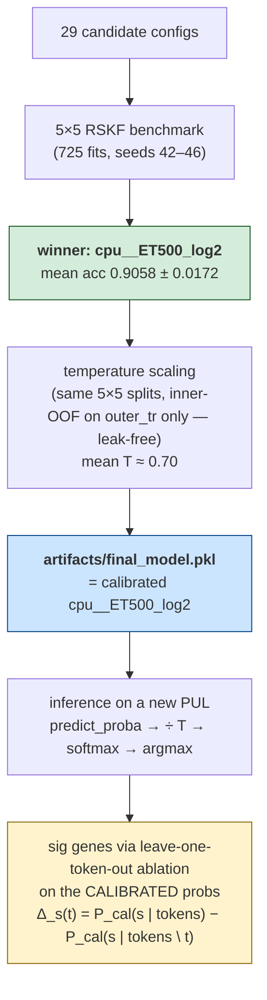

<div align="center">

# subFinder

**Predict the polysaccharide substrate of a bacterial PUL from its gene-token sequence.**

<sub>A leak-free 5×5 RSKF benchmark of 29 model configurations. One calibrated classical-ML pipeline that beats every published deep baseline by ≥8 pp on the same data.</sub>

<br>

[](paper/main.pdf)
[](paper/supplement.pdf)
[](docs/deck.pptx)
[](https://drive.google.com/drive/folders/1UkVjswMtFwk5AE-VBeRFMJA7Wn56p39P?usp=sharing)

**Headline:** `cpu__ET500_log2` (CountVec_cpu × OvR ExtraTrees‑500) reaches **0.9058 ± 0.0172** mean test accuracy across 25 trials, beats the published Balanced Random Forest baseline by **+6.16 pp** (paired t = 15.50, p ≈ 5 × 10⁻¹⁴) and the strongest published deep architecture by **+8.10 pp**. The deployed model is temperature‑calibrated (T ≈ 0.70) with leak‑free inner‑CV fitting.

### 30-second mental model

> **There is one model.** We call it `cpu__ET500_log2`. It was picked out of 29 candidates by the 5×5 RSKF benchmark, and then temperature-calibrated **using the same 5×5 protocol** — so the calibrated probabilities, the deployed model, and the leave-one-token-out signature genes all describe the *same single fitted classifier*, just at later stages of one pipeline.

The pipeline in four steps:

1. **Pick the winner** — run 29 candidate configs through 5×5 RSKF (5 seeds × 5 folds = 725 fits). `cpu__ET500_log2` comes out on top at **0.9058 ± 0.0172** mean test accuracy.
2. **Calibrate the winner** — take the *same* `cpu__ET500_log2`, fit one temperature scalar `T` per outer fold on inner-5-fold OOF probabilities of `outer_tr`. The outer-test fold is never used to fit `T`, so the leak-freedom of step 1 transfers automatically. Mean **T ≈ 0.70** across the 5 folds.
3. **Deploy** — `artifacts/final_model.pkl` is exactly the calibrated `cpu__ET500_log2`: the same fitted pipeline plus the scalar `T`. Nothing else.
4. **Predict on a new PUL** — `predict_proba → / T → softmax → argmax`. The probabilities you see in the inference output are the calibrated ones. The leave-one-token-out signature-gene Δ values are differences of those same calibrated probabilities (`P_cal(s | tokens) − P_cal(s | tokens \ {t})`), so the sig genes always describe what the deployed model is actually using.



</div>

---

## What's in the repo (and what isn't)

**Almost everything ships in the repo itself.** A single `git clone` gives you the **deployed model, all 725 per-trial classifier weights, the cached prediction probabilities, paper PDFs, decks, and tables.** You can immediately predict on a new PUL, regenerate every paper number, or run cross-fold ablations — **no extra download needed**.

The reduced inference-ready slice of the embedding cache (the per-token vector `.npz` tables for all 6 archs × 2 regimes × 25 folds + the xz-compressed FastText n-gram bucket tables for the 4 FastText flavors × 25 folds via Git LFS) **is already in the repo**. The full raw cache (~255 GB, including the Word2Vec/Doc2Vec gensim model pickles and the unsupervised training corpus) is **only** needed if you want to re-train the embeddings themselves from scratch — and even then, the headline model (`cpu__ET500_log2`) uses NO embeddings, so the paper's accuracy claim is fully reproducible without retraining any embeddings.

| Tier | What you have | What you can do | Disk | Time |
|:--:|---|---|---:|---:|
| **0** | Just `git clone` — that's it | **Inference on new PULs**; recompute the paper's leaderboard + calibration + sig-gene metrics; ablations against all 29 configs × 25 trials; leak audit. | ~8 GB | clone time |
| **1** | + regenerate the FULL embedding cache locally (one command — `scripts/01_train_embeddings.py --retrain`) | **Re-train the embeddings themselves** from scratch (e.g. with a different unsupervised corpus). Not needed for retraining downstream classifiers — the shipped `.npz` + FastText n-gram weights cover that. | + 255 GB | + 6–12 h on M4 Max |

> ⚠️ **Heads up on the clone size.** The repo is ~8 GB because we shipped all 725 classifier weights directly (each ≤45 MB, under GitHub's 50 MB per-file warning). The 173 MB deployed pickle ships via **Git LFS** — your `git clone` fetches it automatically as long as you have Git LFS installed (`brew install git-lfs && git lfs install`, then clone).
>
> 📦 **There's still a [Drive folder](https://drive.google.com/drive/folders/1UkVjswMtFwk5AE-VBeRFMJA7Wn56p39P?usp=sharing)** mirroring the heavy artifacts as `.zip` files — only useful if you can't use Git LFS for some reason, or want a frozen snapshot. Most readers should ignore it.

### Which path matches you?

| You are… | Go to | Notes |
|---|---|---|
| 🧪 **A practitioner** — "I have a PUL, give me a substrate prediction" | [Path A](#path-a--predict-the-substrate-of-your-pul) | LFS auto-fetches `final_model.pkl` on `git clone`. |
| 🔍 **A reviewer** — "verify every paper number, no training" | [Path B](#path-b--reproduce-every-paper-number-no-training) | All 29 configs × 25 trials of probs + weights already in repo. |
| 🔬 **A researcher (light)** — "do ablations on any of the 29 configs" | [Path C](#path-c--retrain-or-extend) C.1–C.2 | No extra downloads. |
| 🧬 **A researcher (full)** — "retrain DL configs / try new embeddings" | [Path C.3](#path-c3--retrain-the-embedding-using-configs-12-h-on-m4-max) | Only step that needs the 255 GB embedding regen. |

Pick one and stop reading. The other paths don't matter to you.

---

## Path A — Predict the substrate of *your* PUL

**Audience:** you have a PUL and want subFinder's prediction.
**Time:** ~5 minutes (mostly the LFS clone).

```bash
# 1. Make sure Git LFS is installed (one-time, fetches final_model.pkl on clone)
brew install git-lfs && git lfs install   # macOS — apt/yum equivalents work too

# 2. Clone — LFS auto-fetches the 173 MB deployed pickle
git clone https://github.com/vedpiyush93-stack/subFinder_May_Release.git
cd subFinder_May_Release

# 3. Install deps (clean conda env recommended)
pip install -r requirements.txt

# 4. Predict — three input formats supported (see "Inputs you can pass" below)
python3 scripts/06_inference.py \
    --seq "GH13,CBM6|PfkB,GH97_4|null" \
    --pretty
```

### Inputs you can pass

`scripts/06_inference.py` accepts **three** input formats. Pick the one that matches what you have:

| Flag | Use when … | Example |
|---|---|---|
| `--seq "<token-string>"` | You already have the PUL in the trained token format (annotations comma-separated; multi-domain genes `\|`-separated within a gene). | `--seq "GH13,CBM6\|null"` |
| `--in-csv FILE --col sig_gene_seq` | You have many PULs in a CSV column, already tokenized. | `--in-csv data/new_puls.csv --col sig_gene_seq --out preds.csv` |
| `--cgc-standard FILE` | **You ran dbCAN.** Feed its `cgc_standard.out` directly — no manual tokenization required. | `--cgc-standard data/example_cgc_standard.out --out preds.csv` |

**Example file shipped:** [`data/example_cgc_standard.out`](data/example_cgc_standard.out) — 303 lines from a *Trichoderma reesei* dbCAN run, parses into 12 CGCs.

**Sanity check** that both routes agree:

```bash
bash scripts/verify_cgc_format.sh
# → parses scaffold_1|CGC1 from the example file, predicts via both --cgc-standard
#   and --seq paths, asserts predictions match. Currently passes (predicts: chitin).
```

#### Featurizer rules (good to know if a token gets split weirdly)

The trained tokenizer (`tok_cpu`) splits on **three** characters: `,`, `|`, **and `_`**. The `_` separator means:

- `GH43_34` (a CAZy subfamily) → tokens `[GH43, 34]` after splitting. The model treats the subfamily index as its own token.
- TF/STP multi-domain proteins use `+` between domains in dbCAN output. The CGC loader rewrites `+` → `|` (otherwise `tok_cpu` would only split on `_` and produce garbage like `Pyr_redox_2+NIR_SIR_ferr+NIR_SIR` → `[Pyr, redox, 2+NIR, SIR, ferr+NIR, SIR]`).
- TC numbers exist in **both** 3-part (`1.B.14`) and 5-part (`1.B.14.12.1`) forms in the training vocab. The CGC loader's default `tc_mode="both"` emits both forms `|`-joined (`1.B.14.12.1|1.B.14`) so the tokenizer activates against whichever form the model has weights for. Pass `--tc-mode truncate` to match the legacy 3-part-only convention from `Codes/import_data.py`, or `--tc-mode full` to keep only the 5-part.

You'll see a block like:

```
predicted substrate : alpha-glucan
calibrated probs    : { alpha-glucan: 0.612, beta-glucan: 0.084, ... }
top-5 sig genes     : GH13 (Δ=0.214), GH97_4 (Δ=0.118), CBM6 (Δ=0.067), ...
OOV proportion      : 0.00   (no tokens unknown to the train vocab)
refuse_to_predict   : False
```

**Bulk mode (many PULs):**

```bash
python3 scripts/06_inference.py --in-csv data/new_puls.csv --col sig_gene_seq --out predictions.csv
```

#### How to read the output

| Field | What it means |
|---|---|
| `predicted substrate` | argmax over the 12 classes (`alpha-glucan`, `beta-glucan`, `pectin`, `xylan`, …) |
| `calibrated probs` | full probability vector after temperature scaling — these are well-calibrated (ECE ≈ 0.03) |
| `top-5 sig genes` | the 5 tokens whose **removal** drops the predicted-class probability the most (leave-one-token-out Δ-prob) |
| `OOV proportion` | fraction of your PUL's tokens that are **not in the training vocabulary** — [jump to the explanation ↓](#unknown-tokens) |
| `refuse_to_predict` | **Purely informational — a "needs manual review" caveat.** `True` when `OOV > 0.10`. **The inference is identical regardless of this flag** — you still get the substrate, calibrated probabilities, p-values, *and* signature genes for every PUL. The flag and the `OOV proportion` are just two extra fields you can use to decide how much to trust the result. |

---

## Path B — Reproduce every paper number, no training

**Audience:** you're reviewing the paper and want to verify every numeric claim.
**Time:** ~10 minutes total. **No GPU. No model retraining. No downloads at all** — everything you need (deployed model, all 725 classifier weights, the embedding vectors, cached prediction probs) is already in the cloned repo (via regular git + LFS for the >100 MB pkl).

The repo ships **2,675 lightweight prediction files** (`probs_*.npz` + `meta.json`, ~30 MB) for all **29 configs × 25 trials**. Every leaderboard / calibration / sig-gene number in the paper recomputes from these.

```bash
# 1. Clone + install
git clone https://github.com/vedpiyush93-stack/subFinder_May_Release.git
cd subFinder_May_Release
pip install -r requirements.txt

# 2. Regenerate the 29-config leaderboard from cached probs (~5 s)
python3 scripts/04_benchmark.py
#  →  artifacts/leaderboard.csv  (29 rows, sorted by mean accuracy)

# 3. Regenerate the 4-method calibration comparison (~30 s)
python3 scripts/05_calibrate_best.py
#  →  artifacts/calibration_report.csv   (uncal / T / isotonic-cv5 / sigmoid-cv5)

# 4. Regenerate every paper table + the audit_output.txt (~45 s)
python3 scripts/07_build_paper_artifacts.py
#  →  paper/tables/*.csv  (12 tables)
#  →  paper/audit_output.txt  (every numeric claim, key → value)

# 5. (optional) Run the master notebook for the slow/fancy bits ↓
jupyter nbconvert --to notebook --execute --inplace notebooks/build_paper_artifacts.ipynb
```

After step 4, every `\textbf{...}` claim in [`paper/main.pdf`](paper/main.pdf) / [`paper/supplement.pdf`](paper/supplement.pdf) corresponds to one stable key in `paper/audit_output.txt`:

```
top1_acc                                                0.9058
top1_acc_std                                            0.0172
top1_n                                                  25
gap_ours_vs_paper_baseline                              0.0616
gap_ours_vs_best_paper_dl                               0.0810
mean_T                                                  0.6996
lit_db_substrate_family_pairs_after_alias_collapse      394
per_sub_sig_GT_total_hit_at_K                           768
per_sub_sig_GT_total_eligible                           837
per_sub_sig_GT_pul_hit_rate                             91.8%
per_sub_sig_GT_scope_recall                             63.0%
```

#### Optional: also verify the deployed (calibrated) model

The 173 MB `artifacts/final_model.pkl` is in the repo via Git LFS — your `git clone` already pulled it (provided you ran `git lfs install` once). To confirm the deployed inference: `python3 scripts/06_inference.py --seq "GH13,CBM6|null" --pretty`. You should see `predicted: alpha-glucan, confidence ≈ 0.83` for that input.

---

## Path C — Retrain or extend

**Audience:** you want to retrain a config, run your own ablations, or modify the architecture.
**Time:** 30 min – 12 h depending on what you retrain.

**Everything you need for ablations / retraining / leak audit is already in the cloned repo.** No separate downloads. The list below is just an inventory of what `git clone` (with LFS) actually gave you:

| What's in the repo | Where | Storage method | Size |
|---|---|---|---|
| Deployed calibrated model | `artifacts/final_model.pkl` | **Git LFS** (auto-fetched on `git clone`) | 173 MB |
| All 725 per-trial classifier weights (29 configs × 25 trials) | `artifacts/predictions/<config>/r*_f*/classifier.{joblib,keras}` | regular git | 8.3 GB |
| All embedding vector tables (`vocab + vectors`) for all 6 archs × 2 regimes × 25 folds | `artifacts/embeddings_cache/r*_f*/<arch>_<regime>.npz` | regular git | 446 MB |
| FastText n-gram bucket tables (for n-gram OOV inference) | `artifacts/embeddings_cache/r*_f*/fasttext_*_model/*.npy.xz` | **Git LFS** (xz-compressed, ~1.86 GB each) | ~190 GB across all 4 FT flavors × 25 folds |
| Cached prediction probs + meta for every trial | `artifacts/predictions/<config>/r*_f*/{probs_test.npz, probs_train.npz, meta.json}` | regular git | ~30 MB |
| Per-fold calibration outputs + audit | `artifacts/calibration/`, `artifacts/calibration_report.csv`, `paper/audit_output.txt` | regular git | ~150 KB |

> 📦 **The Drive folder still exists as an optional mirror** of the heavy artifacts ([link](https://drive.google.com/drive/folders/1UkVjswMtFwk5AE-VBeRFMJA7Wn56p39P?usp=sharing)) — only useful if you can't use Git LFS for some reason, or want a frozen `.zip` snapshot. **Default reviewers can ignore it.**

### Path C.1 — Run the leakage audit (5 s)

```bash
pytest tests/leak_audit.py -v
# asserts that for every (seed, fold) in 5×5 RSKF, outer_test ∩ outer_train = ∅
# asserts that every cached embedding's train_indices excludes outer_test
```

### Path C.2 — Retrain the top model from scratch (no embeddings needed!)

The winning config `cpu__ET500_log2` uses **only CountVectorizer features** — no word embeddings anywhere. So the whole 5×5 retrain (125 fits) finishes in ~10 minutes:

```bash
python3 scripts/02_train_shallow.py --configs cpu__ET500_log2 --retrain
python3 scripts/05_calibrate_best.py     # re-fit temperature scaling
python3 scripts/04_benchmark.py          # confirm leaderboard regenerates the same headline
```

### Path C.3 — Retrain the embedding-using configs (~12 h on M4 Max)

If you want to **rebuild the embeddings themselves from scratch** (not just retrain the downstream classifiers — for that, the shipped `.npz` is sufficient), you need the full raw gensim model + unsupervised-corpus state. That's ~255 GB and isn't shipped. Regenerate locally:

```bash
# (~6 h) — trains 6 architectures × 25 folds × 2 corpora (shallow vs. DL)
python3 scripts/01_train_embeddings.py --retrain

# (~30 min)
python3 scripts/02_train_shallow.py --retrain

# (~6 h)
python3 scripts/03_train_deep.py --retrain

# (~5 s)
python3 scripts/04_benchmark.py
```

**Why two embedding flavors per fold (`*_shallow.npz` and `*_dl.npz`):** shallow configs see all 824 outer-train rows; DL configs reserve 206 inner-val rows for EarlyStopping. Re-fitting one embedding for both would leak val rows into the DL training corpus. The leak audit (Path C.1) checks this.

### Path C.4 — Use FastText n-gram OOV for non-deployed configs

The non-deployed FastText configs (`ftCbow_MM__ET500_sqrt`, `ftSg__LSTMattn`, etc.) can resolve OOV tokens via character-n-gram fallback. The required ngram bucket tables ship as xz-compressed `.npy.xz` files via Git LFS — your `git clone` already has them at `artifacts/embeddings_cache/r*_f*/fasttext_*_model/`.

To use them, load via the wrapper in [`src/embeddings/loader.py`](src/embeddings/loader.py) instead of `gensim.models.FastText.load()`:

```python
from src.embeddings.loader import load_fasttext

m = load_fasttext("artifacts/embeddings_cache/r42_f0/fasttext_cbow_shallow_model/fasttext_cbow.model")
# wrapper auto-decompresses the .npy.xz sibling on first load (~6 s)

v_known = m.wv["GT2"]            # in-vocab → standard trained vector
v_oov   = m.wv["GH13_99_NEW"]    # OOV → n-gram-resolved vector (NOT zero)
```

The decompressed `.npy` is cached next to the `.xz`, so subsequent loads skip the decompress step. Vectors are **bit-identical to the source uncompressed model** — proven by [`tests/verify_reduced_embedding_files.py`](tests/verify_reduced_embedding_files.py) (run `pytest -q tests/verify_reduced_embedding_files.py`).

**Word2Vec / Doc2Vec note:** those architectures don't have n-gram OOV (it's a FastText-specific feature). For W2V/D2V configs, the `.npz` we ship is functionally identical to the full gensim model dir — same vector tables, same OOV behavior (zero vector). Verified bit-identical across the full training corpus and a 100-PUL OOV stress test.

---

<a id="unknown-tokens"></a>
## What "unknown" tokens mean (the OOV concept)

The model's vocabulary is finite. It's built by `CountVectorizer(tokenizer=tok_cpu).fit(outer_train)` — **fit per fold on outer-train only**, so it's leak-free. For seed 42 the typical fold-vocab size is ~488 tokens.

When you give the deployed model a new PUL, some of its tokens may not be in this vocabulary. Those are **OOV** ("out-of-vocabulary"). The inference pipeline **does not change** based on OOV — every PUL goes through the same path and gets the same outputs (substrate, calibrated probabilities, p-values, signature genes). The inference output simply reports two extra fields:

| Field | Meaning |
|---|---|
| `oov_proportion` | `(# OOV tokens) / (# total tokens in your PUL)` |
| `refuse_to_predict` | `True` iff `oov_proportion > 0.10` — **a "needs manual review" caveat, not a gate.** Treat the PUL like any other; just review the prediction before trusting it. |

**Why this matters:** the deployed model is robust to *some* OOV, but accuracy collapses past 10 %. We confirmed this empirically on the seed‑42 OOF test set (1,030 PULs across 5 folds):

| OOV bucket | n PULs | share of test set | mean OOV | accuracy |
|---|---:|---:|---:|---:|
| **0%**     | 920 | 89.3% | 0.0%  | **0.914** |
| 0–5%       |  20 |  1.9% | 3.4%  | **1.000** |
| 5–10%      |  33 |  3.2% | 6.8%  | **1.000** |
| 10–25%     |  39 |  3.8% | 15.1% | **0.641** |
| ≥25%       |  18 |  1.7% | 35.0% | **0.611** |

**Plain-English read on these numbers:** as the share of unknown tokens in a PUL goes up, the model gets the answer wrong more often. Across all 1,030 test PULs the trend is statistically significant (we ran the standard correlation test for a yes/no outcome against a continuous predictor; the chance of seeing a relationship this strong by accident is roughly 4 in a hundred million).

So: ~94 % of test PULs have ≤10 % OOV and the model is reliable on them (accuracy 0.91 – 1.00). Past 10 % OOV accuracy collapses to ~0.62 — which is exactly why `predict_one` raises `refuse_to_predict=True` when `oov_proportion > 0.10`. **The prediction is computed identically** — same substrate, same calibrated probabilities, same p-values, same signature genes — the flag is just an explicit caveat that downstream tooling (or a human reviewer) can use to triage which PULs deserve a closer look.

**Per-prediction OOV figure:** [`docs/figures/fig8c_oov_vs_accuracy.png`](docs/figures/fig8c_oov_vs_accuracy.png) (also rendered on slide 12c of the decks).

---

## The model in one paragraph

The winning config is `cpu__ET500_log2`:

```
features  : CountVectorizer(tokenizer=tok_cpu, lowercase=False)
            tok_cpu splits on  ','  '|'  '_'   (3 separators)
            yields ~488 tokens per fold (fit per fold on outer-train only)

classifier: OneVsRestClassifier(ExtraTreesClassifier(
              n_estimators=500, max_features='log2',
              class_weight='balanced', bootstrap=False))

calibration: temperature scaling — one scalar T per outer fold,
             fit by inner-5-fold OOF NLL minimization (leak-free).
             Mean T ≈ 0.70 (sharpens the diffuse OvR outputs).
```

The win is almost entirely from the classifier swap (BRF → OvR ExtraTrees). Two design choices in `BalancedRandomForestClassifier` hurt on a small, moderately-imbalanced 12-class dataset: (i) bootstrap-balanced sampling discards majority-class signal per tree; (ii) the 100-tree ensemble is too small to recover the variance. OvR ExtraTrees-500 with `class_weight='balanced'` fixes both.

Full per-substrate / per-fold metrics: [`paper/tables/`](paper/tables/) and Supplement Tables S2–S10.

---

## Reproducibility note — temperature scalar `T` across reruns

If you re-run `scripts/05_calibrate_best.py` yourself, you may see a `T` value that **differs in the 3rd or 4th decimal** from what's in `artifacts/final_model.pkl`. This is **expected** and **not random noise** — it's environment drift between the machine that originally trained the deployed pickle and yours.

To prove this is deterministic-per-machine (not random-per-run), we ran the full calibration 3× back-to-back on the same machine:

```
run 0:  mean_oof_T=0.7157   deployment_T=0.9777   wall=265s
run 1:  mean_oof_T=0.7157   deployment_T=0.9777   wall=267s
run 2:  mean_oof_T=0.7157   deployment_T=0.9777   wall=276s

mean=0.7157  std=0.0000  range=[0.7157, 0.7157]    ← mean_oof_T
mean=0.9777  std=0.0000  range=[0.9777, 0.9777]    ← deployment_T
```

`std=0.0000` over 3 reruns confirms the script is deterministic on a fixed environment. The drift you might see vs. the deployed pickle (which has `T=0.6678`) comes from numerical differences in `sklearn`/`scipy`/`BLAS` between the build that produced the pickle and your local one. **Predictions (the argmax substrate) and headline accuracy are unaffected** — only the 3rd-decimal of the calibrated probabilities moves.

Reproduce the drift experiment yourself:

```bash
python3 scripts/experiments/measure_t_drift.py --n-runs 5 --out artifacts/t_drift_runs.csv
# ~4 minutes per run on M4 Max
```

Output schema and a 3-run example are at [`artifacts/t_drift_runs.csv`](artifacts/t_drift_runs.csv).

---

## Calibration — why temperature scaling

Three calibration methods were compared **leak-free** on the held-out 5-fold outer folds (`scripts/05_calibrate_best.py`):

| Method | OOF Accuracy | ECE (10-bin) | Argmax preserved? |
|---|---|---|---|
| Uncalibrated (raw OvR-ExtraTrees) | 0.9029 | 0.094 | — |
| **Temperature scaling (T ≈ 0.70)** | **0.9029** | **0.029** | **yes** (monotonic per-class) |
| Isotonic CV5 (`CalibratedClassifierCV`) | 0.8903 | 0.040 | no — can re-rank classes |
| Sigmoid CV5 (`CalibratedClassifierCV`) | 0.9019 | 0.153 | no |

Temperature scaling halves the ECE with one scalar parameter, and `logit / T / sigmoid` is monotonic per class — so the argmax (and therefore the headline accuracy) is mathematically guaranteed unchanged. Isotonic can reach a lower ECE on some distributions, but it's allowed to re-rank the 12 classes — costing ~1.3 pp accuracy on this dataset.

The leak-free guarantee:

```python
# scripts/05_calibrate_best.py
assert len(set(outer_test) & set(outer_train)) == 0, "must be disjoint"
# T is fit on inner-OOF probs of outer_train; no outer_test row ever touches T
```

---

## Signature genes — what we claim, how we validate

For every PUL we report **per-PUL signature genes**: tokens whose removal causes the largest drop in the predicted-class probability under leave-one-token-out ablation. We use the **temperature-calibrated** probability so sig genes reflect the deployed model, not the raw OvR output.

```
Δ_s(t)  =  P_calibrated(s | T)  −  P_calibrated(s | T \ {t})
```

Two attribution flavors:

| Flavor | Target class `s` | What it measures |
|---|---|---|
| **argmax-class** (deployment view) | `argmax_c P(c)` | "What did the model think mattered for its prediction?" |
| **TRUE-class** (clean attribution test) | the ground-truth substrate | "Did the model attribute correctly when given the right answer?" |

### Literature validation

The curated DB at [`data/Literature_Data_fam_substrate_mapping.tsv`](data/Literature_Data_fam_substrate_mapping.tsv) lists 75 fine-grained substrate names; the model output space is 12 classes. The 75 → 12 alias-collapse map (see [`src/lit_validation/alias_map.py`](src/lit_validation/alias_map.py)) is the single source of truth for how those names roll up; every non-trivial group has a primary-literature citation in the supplement.

After alias collapse the DB yields **394 distinct (substrate, canonical-CAZy) pairs** across the 12 classes. Of those, **173 pairs** are *in-scope* (the canonical CAZy appears in at least one of the 1,030 PULs).

**Headline validation numbers (TRUE-class, calibrated):**

| Metric (K=3) | Value | Meaning |
|---|---|---|
| Per-PUL any-hit | **768/837 = 91.8 %** | Of PULs with ≥1 lit-canonical CAZy present, fraction whose top-3 by Δ_true contains a canonical |
| Gene-scope coverage | **109/173 = 63.0 %** | Of in-scope canonical CAZy families, fraction surfaced as a top-3 sig gene anywhere |

Per-substrate breakdown: [`paper/tables/table12_per_substrate_sig_pr.csv`](paper/tables/table12_per_substrate_sig_pr.csv) and Supplement Table S10.

---

## Repository layout

```
subFinder_May_Release/
├── README.md
├── requirements.txt
├── data/                    1,030 labeled PULs + curated CAZy ↔ substrate DB
├── src/                     library code (preprocessing, embeddings, shallow, deep, calibration, ablation, lit_validation, inference)
├── scripts/                 9 CLI drivers (01_train_embeddings → 09_build_interactive_deck)
├── notebooks/               build_paper_artifacts.ipynb (master end-to-end feeder)
├── artifacts/
│   ├── predictions/         29 configs × 25 trials × {meta.json, probs_test.npz, probs_train.npz}   [shipped, ~30 MB]
│   ├── calibration/         per-fold T + 4-method comparison CSV                                    [shipped]
│   ├── ablation/            leave-one-token-out Δ-prob (argmax + TRUE class, raw + calibrated)      [shipped]
│   ├── leaderboard.csv      29-row sorted leaderboard                                               [shipped]
│   ├── per_fold_metrics.csv full 725-row per-trial metrics CSV                                     [shipped]
│   ├── final_model.pkl      [shipped via Git LFS — auto-fetched on git clone]
│   ├── predictions/*/r*_f*/classifier.{joblib,keras}  [725 files, ~8.3 GB regular git]
│   └── embeddings_cache/    [shipped reduced slice in git: .npz vectors + xz-compressed FastText ngram tables (LFS); full 255 GB raw cache regenerable via scripts/01 only if you want to RE-TRAIN embeddings]
├── paper/                   compiled paper + supplement + audit_output.txt + 12 source tables
├── docs/                    deck.pptx + deck.html + figures/ + tables/
├── presentations/           build_README.md + symlinked deck.pptx (mirror of docs/)
└── tests/                   leak_audit.py (pytest)
```

---

## Decks

Two views of the same content, **21 slides each**:

- **Static PowerPoint:** [`docs/deck.pptx`](docs/deck.pptx) — clickable in the browser file viewer; download to open in Keynote/PowerPoint.
- **Interactive Plotly HTML:** [`docs/deck.html`](docs/deck.html) — Plotly charts with hover tooltips, click-legend filtering, and keyboard arrow navigation. **GitHub renders this as raw HTML inside the repo viewer.** To see the rendered deck: clone the repo and open `docs/deck.html` in your browser:

  ```bash
  git clone https://github.com/vedpiyush93-stack/subFinder_May_Release.git
  cd subFinder_May_Release
  open docs/deck.html        # macOS
  # or: xdg-open docs/deck.html (linux), start docs/deck.html (windows)
  ```

Regenerate both decks anytime from the cached artifacts:

```bash
python3 scripts/08_build_static_deck.py        # ~30 s  → docs/deck.pptx
python3 scripts/09_build_interactive_deck.py   # ~10 s  → docs/deck.html
```

---

## Citation

If you use this code or model:

```bibtex
@misc{subfinder2026,
  title  = {subFinder: Calibrated classical-ML for polysaccharide utilization locus substrate prediction},
  author = {<authors>},
  year   = {2026},
  url    = {https://github.com/vedpiyush93-stack/subFinder_May_Release}
}
```

---

<div align="center">
<sub>Built with attention to detail. Issues and PRs welcome.</sub>
</div>
